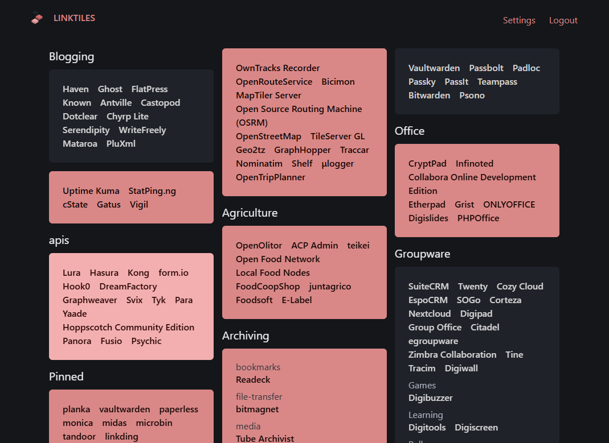
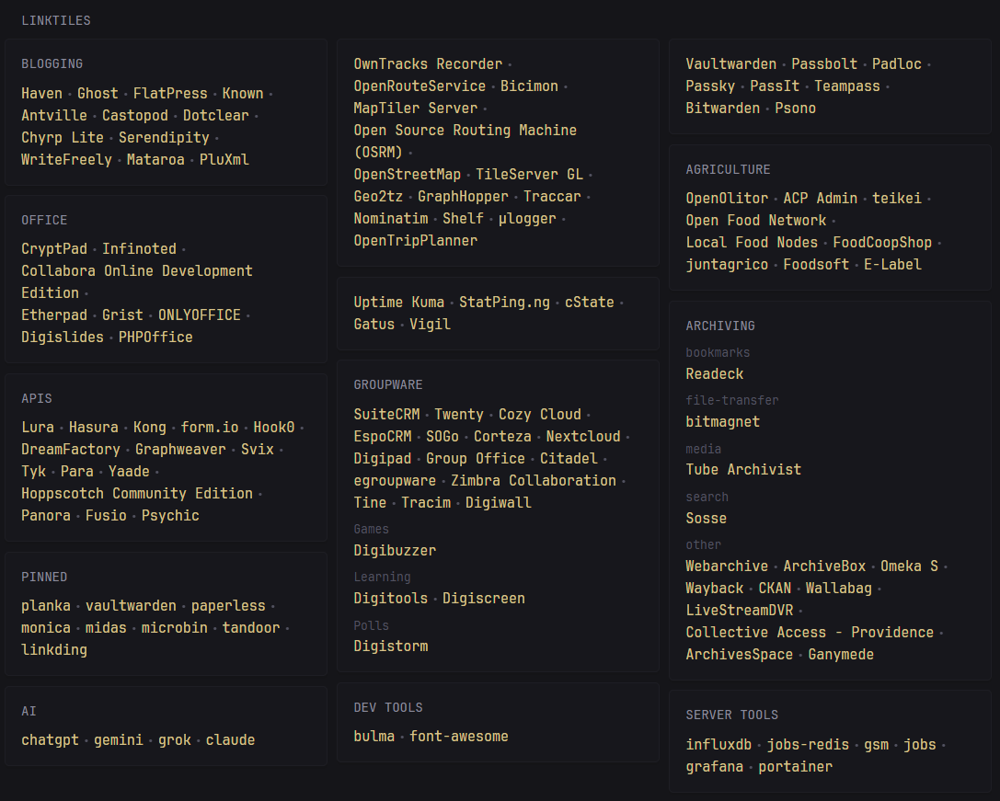

<div align="center">
    <br>
    
    <br>
</div>

## Introduction

linktiles is a tile-based read-only frontend for [linkding](https://github.com/sissbruecker/linkding), a minimal bookmark manager. linktiles uses an api key to fetch links from your linkding instance, and displays them in a configurable mosaic.

**Feature Overview:**

- Clean UI matching the style of linkding
- Display tagged bookmarks as tiles
- Create groups of bookmarks within a tile
- Various configuration options to change the look of the tiles
- SSO support via authentication proxies
- Built-in [Glance](https://github.com/glanceapp/glance) extension.

**Gallery**



**Glance extension**



## Quickstart

The recommended method of installation is Docker Compose. By default, linktiles will persist data in memory. This is good for testing it out, but long term you will want to set up a Redis container for persistence.

```yml
services:
  linktiles:
    image: haumea/linktiles:latest
    container_name: linktiles
    ports:
      - 5001:5001
```

Run `docker compose up -d` and you should be able to visit the UI at http://localhost:5001/. For more details, visit the [docs](https://docs.haondt.dev/linktiles/).

## Contributing

Contributions are welcome, but may be denied if I feel they don't fit the scope of the app. Please on PRs on [GitLab](https://gitlab.com/haondt/linktiles/).

## Development

The application is built using the Flask web framework. You can get started by checking out the excellent [Flask docs](https://flask.palletsprojects.com/en/stable/). The `app` folder contains the actual tiles application. The python stuff follows your typical Flask structure, and frontend interactivity is done through [htmx](https://htmx.org/) and [hyperscript](https://hyperscript.org/).

**Prerequisites**:
-  Python 3.10

**Setup**

Create a [virtual environment](https://docs.python.org/3/tutorial/venv.html) for the application

```sh
python3 -m venv venv
. ./venv/bin/activate
```

Install the requirements

```sh
python3 -m pip install -r requirements.txt
```

By default the application will use an in-memory storage for data, meaninig it will be lost every time you restart the application. To persist data, at the time of writing, the only option is a [redis](https://redis.io/) instance. Check the configuration for which environment variables can be used to configure the redis storage.

Start the Flask server with debug mode enabled with

```sh
LT_ENVIRONMENT=dev python3 -m app
```

The frontend is now available under http://localhost:5001
