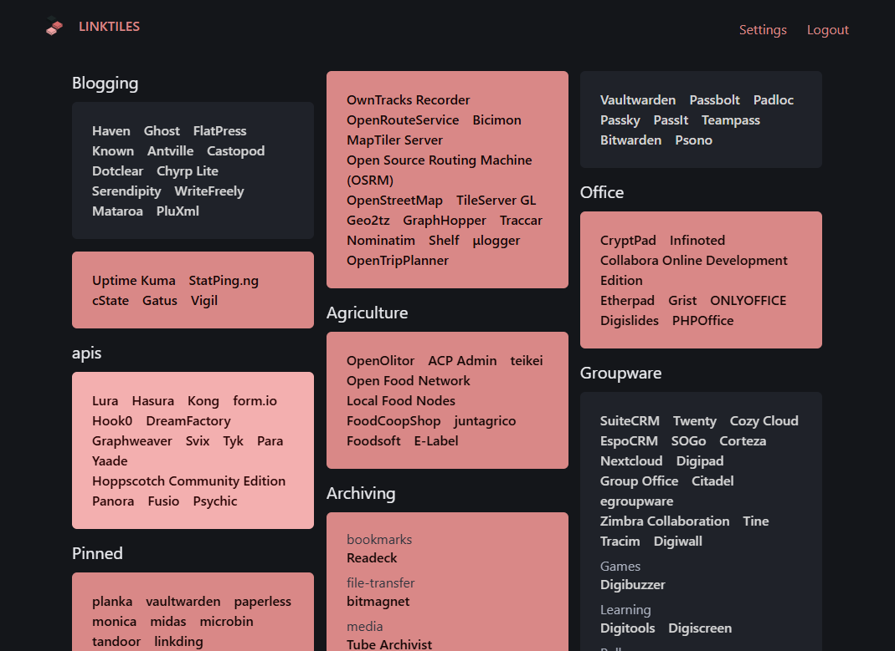
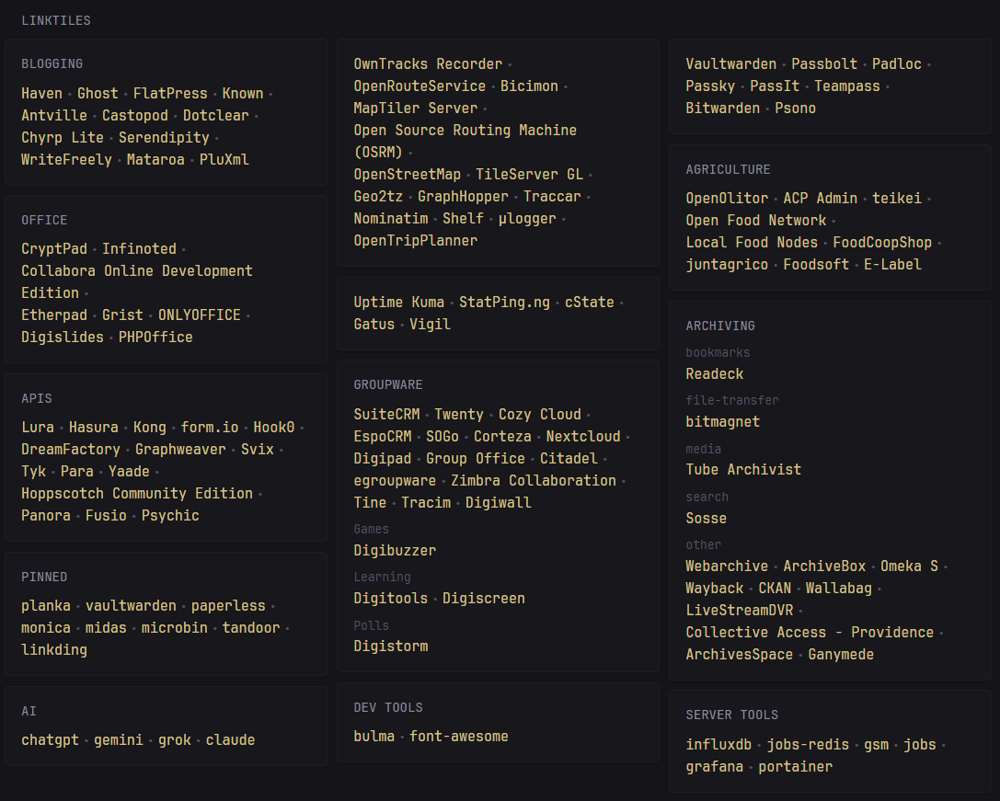

# linktiles 

linktiles is a tile-based read-only frontend for linkding, a minimal bookmark manager. linktiles uses an api key to fetch links from your linkding instance, and displays them in a configurable mosaic.

Feature Overview:

- Clean UI matching the style of linkding
- Display tagged bookmarks as tiles
- Create groups of bookmarks within a tile
- Various configuration options to change the look of the tiles
- SSO support via authentication proxies

Check the [installation](./installation.md) guide to get started.

## Gallery

linktiles offers several customization options, which allow you to change the look and feel of the tile layout.

<figure markdown="span">
  
  <figcaption>Masonry layout</figcaption>
</figure>
<figure markdown="span">
  
  <figcaption>Ghost fill</figcaption>
</figure>

### Glance

linktiles will also propogate the styling configuration to the Glance extension.

<figure markdown="span">
  
  <figcaption>Masonry layout</figcaption>
</figure>
<figure markdown="span">
  
  <figcaption>Ghost fill</figcaption>
</figure>

